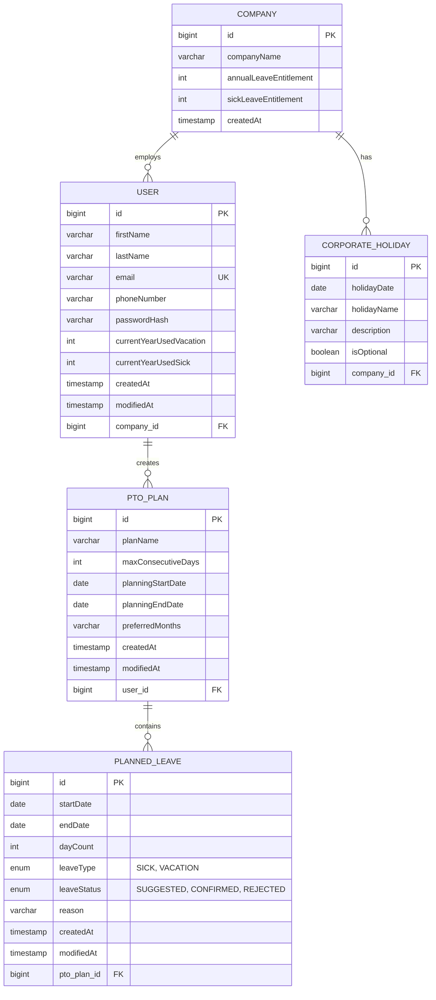

# PTOBuddy - Smart Holiday Planner 📅

> **Plan Smarter, Vacation Better**

PTOBuddy is an intelligent holiday planning application that optimizes your vacation days using AI-powered algorithms. It analyzes your corporate holiday calendar and personal preferences to suggest the most efficient leave combinations, helping you maximize your time off.

## 🌟 Features

- **Smart AI Planning**: Get up to 40% more vacation days with optimized leave planning
- **Corporate Calendar Integration**: Upload and sync with your company's holiday calendar
- **Long Weekend Optimization**: Automatically detect opportunities for extended weekends
- **Multiple Plan Generation**: Create different plans based on various constraints
- **Excel Template Support**: Easy data import/export functionality
- NOT IN MVP : **Leave Balance Tracking**: Monitor vacation and sick leave usage

## 🚀 Tech Stack

### Backend
- **Java 17** with **Spring Boot 3.x**
- **Spring Security 6** for authentication
- **Spring Data JPA** with Hibernate
- **PostgreSQL** database
- **Maven** for dependency management

### Frontend (Planned)
- **React 18** with TypeScript
- **Tailwind CSS** for styling
- **React Router** for navigation
- **Axios** for API communication

## 📊 Database Schema

### Entity-Relationship Diagram



### Key Relationships
- **Company** has many **Users** and **Corporate Holidays**
- **User** can create multiple **PTO Plans**
- Each **PTO Plan** contains multiple **Planned Leaves**

## 🎨 Frontend UI Flow (PLANNED)

### 1. Authentication
```
┌─────────────────┐
│   Login Form    │
│                 │
│ • Email         │
│ • Password      │
│ • Remember Me   │
│ • Social Login  │
└─────────────────┘
```

### 2. Dashboard (Landing Page)

#### Main Actions Available:

##### **📥 Download Template (PLANNED) **
Users can download an Excel template and fill in details like:

**Holiday Details:**
- Date
- Description  
- Optional (Yes/No)

**Leave Configuration:**
- Number of optional holidays available (e.g., "Out of 4, you can take any 2")
- Available Annual Leaves:
  - Sick Leave Count
  - Vacation Leave Count (Earned + Casual)
- Remaining Leaves:
  - Sick Leave Remaining
  - Vacation Leave Remaining

##### **📤 Upload Corporate Calendar **
Excel file upload functionality

**Form Required Fields (PLANNED):**
- Corporate Holiday Calendar (from downloaded template)
- **Start Date** for Holiday Planning
- **End Date** for Holiday Planning 
  - ☑️ Checkbox: "Default to current year end"
- **Max Consecutive Days** for long weekend optimization
  - ☑️ Checkbox: "Include vacation leaves only"

#### Excel Template Structure (PLANNED)

```
| Date       | Holiday Name    | Description           | Optional |
|------------|----------------|-----------------------|----------|
| 2024-01-26 | Republic Day   | National Holiday      | No       |
| 2024-03-08 | Holi           | Festival of Colors    | No       |
| 2024-03-29 | Good Friday    | Christian Holiday     | Yes      |
| 2024-08-15 | Independence   | National Holiday      | No       |
| 2024-08-27 | Independence   | Ganesh Chaturthi      | Yes      |

Optional Holidays That can be Taken: 1 (Out of 2 available, you can take any 1)

Leave Balances:
- Annual Sick Leave: 12 days
- Annual Vacation Leave: 20 days (15 Earned + 5 Casual)
- Used Sick Leave: 3 days
- Used Vacation Leave: 8 days
- Remaining Sick Leave: 9 days
- Remaining Vacation Leave: 12 days
```

## 🏗️ Project Structure

```
ptobuddy/
├── backend/
│   ├── src/main/java/com/ptobuddy/
│   │   ├── config/          # Security & DB config
│   │   ├── controller/      # REST endpoints
│   │   ├── service/         # Business logic
│   │   ├── repository/      # Data access layer
│   │   ├── model/           # JPA entities
│   │   ├── dto/             # Data transfer objects
│   │   └── util/            # Helper utilities
│   ├── src/main/resources/
│   │   ├── application.yml
│   │   └── db/migration/    # Database scripts
│   └── pom.xml
├── frontend/
│   ├── src/
│   │   ├── components/      # React components
│   │   ├── pages/           # Page components
│   │   ├── services/        # API calls
│   │   ├── utils/           # Helper functions
│   │   └── styles/          # CSS files
│   ├── public/
│   └── package.json
└── README.md
```


## 📋 API Endpoints

### Authentication
- `POST /api/auth/login` - User login
- `POST /api/auth/register` - User registration
- `POST /api/auth/logout` - User logout

### User Management
- `GET /api/users/profile` - Get user profile
- `PUT /api/users/profile` - Update user profile
- `GET /api/users/leave-balance` - Get leave balance

### Holiday Planning
- `POST /api/plans` - Create new PTO plan
- `GET /api/plans` - Get user's PTO plans
- `GET /api/plans/{id}` - Get specific plan details
- `PUT /api/plans/{id}` - Update plan
- `DELETE /api/plans/{id}` - Delete plan

### File Operations
- `GET /api/templates/download` - Download Excel template
- `POST /api/holidays/upload` - Upload corporate calendar
- `POST /api/plans/{id}/export` - Export plan to Excel/PDF

### Corporate Holidays
- `GET /api/holidays` - Get company holidays
- `POST /api/holidays` - Add new holiday (admin)
- `PUT /api/holidays/{id}` - Update holiday (admin)

## 🧠 AI Optimization Algorithm

The smart planning algorithm considers:
- Corporate holidays and long weekends
- User's remaining leave balance
- Maximum consecutive days constraint
- Preferred months selection
- Weekend bridging opportunities
- Team coordination (future feature)

## 🎯 Roadmap

### Phase 1 (MVP)
- [x] Database design
- [x] Entity relationships
- [x] Basic authentication
- [ ] Excel upload/download
- [ ] Basic optimization algorithm
- [ ] Simple UI

### Phase 2
- [ ] Advanced optimization (Leave Balance from last year in consideration)
- [ ] PDF export functionality
- [ ] Email notifications
- [ ] Team coordination features

### Phase 3
- [ ] Google Calendar sync
- [ ] Chrome extension
- [ ] Advanced analytics


## 🙏 Acknowledgments

- Thanks to all corporate employees struggling with leave planning
- Inspired by the need for smarter work-life balance
- Built with ❤️ for the Indian IT community

---

**PTOBuddy** - Because your vacation deserves better planning! 🏖️
